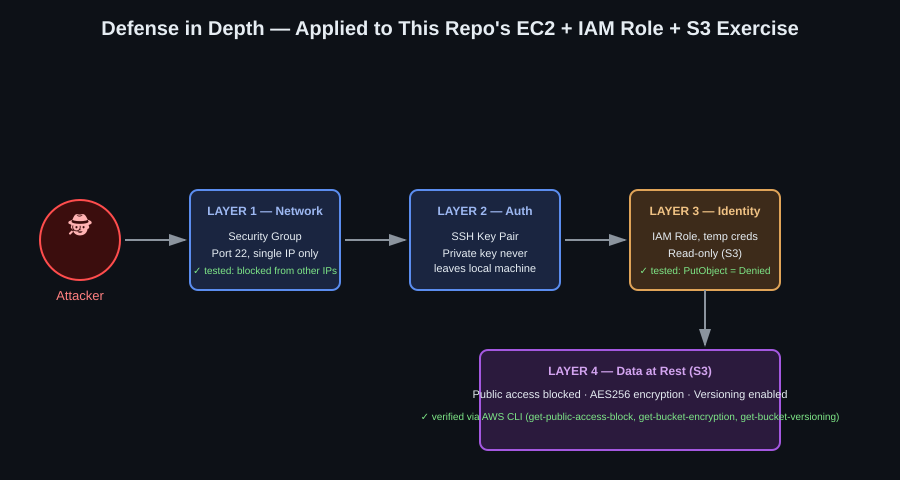

# AWS + Terraform — Cloud Security Practice

Hands-on infrastructure-as-code practice built under mentor guidance, focused on **secure-by-default AWS configurations**. Each exercise was built, verified, and torn down — not just configured, but actively tested (e.g., confirming a blocked SSH connection actually fails, confirming an IAM policy actually denies what it shouldn't allow).

**Background:** [Google Cybersecurity Certificate](https://www.coursera.org/) · [AWS Certified Cloud Practitioner (CLF-C02)](https://www.credly.com/) — pursuing entry-level Cloud Security roles.

## What this repo demonstrates

- **Least-privilege IAM** — users and roles scoped to the minimum permissions needed, verified with `AccessDenied` tests
- **Infrastructure hardening** — S3 public-access blocking, encryption, versioning; EC2 Security Groups restricted to a single IP
- **Credential-free service access** — EC2 reading S3 via an IAM Role + Instance Profile, with zero hardcoded access keys
- **Remote state management** — migrating from local Terraform state to Terraform Cloud
- **Reusable code** — a Terraform module for a hardened S3 bucket
- **The import workflow** — bringing manually-created AWS resources under Terraform's management

## Defense in Depth, applied

Each layer below was individually tested, not just assumed to work:

1. **Network** — Security Group allowing SSH only from a single whitelisted IP (tested: connection from a different network hangs/drops, as expected)
2. **Authentication** — SSH key pair; private key never leaves the local machine
3. **Identity** — IAM Role with read-only S3 access (tested: `PutObject` correctly returns `AccessDenied`)
4. **Data** — S3 bucket with public access blocked, AES256 encryption, and versioning enabled

## Exercises

| Folder | What it covers |
|---|---|
| [`01-s3-basico`](./01-s3-basico) | First Terraform cycle: `init → plan → apply → destroy` with a single S3 bucket |
| [`02-s3-iam-seguridad`](./02-s3-iam-seguridad) | IAM user with a least-privilege read-only policy + S3 hardening (public access block, encryption, versioning) |
| [`03-ec2-security-group`](./03-ec2-security-group) | EC2 instance with a Security Group restricted to a single IP; SSH access tested and verified |
| [`04-ec2-iam-role`](./04-ec2-iam-role) | EC2 reading S3 via an IAM Role + Instance Profile — no access keys used or stored |
| [`05-terraform-modules`](./05-terraform-modules) | Refactored the secure S3 bucket into a reusable Terraform module |
| [`06-terraform-cloud`](./06-terraform-cloud) | Migrating local state to Terraform Cloud; CLI-driven workflow, remote plan/apply |

## Tools used

Terraform (CLI-driven and Terraform Cloud workflows), AWS CLI, AWS IAM/S3/EC2, SSH.

## Notes

- All infrastructure in this repo was destroyed after each exercise (`terraform destroy`) to avoid any ongoing cost.
- No real credentials, IP addresses, or account IDs appear in this repo — see `.gitignore`.
